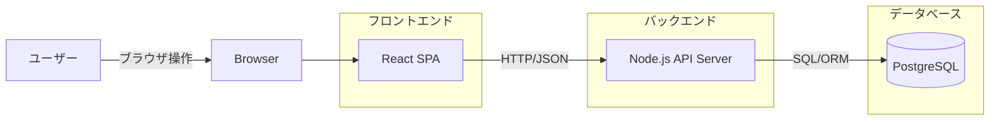
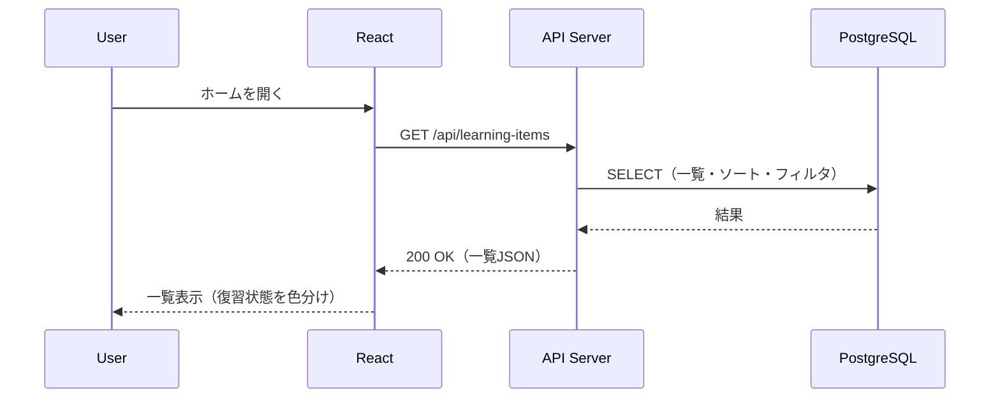
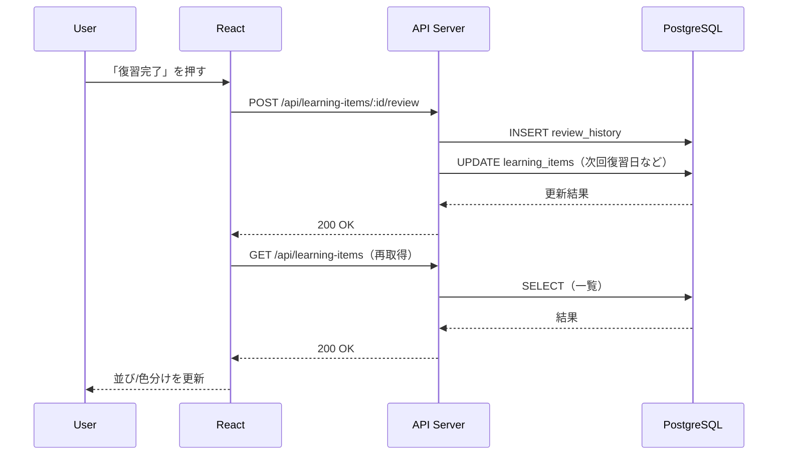

# アーキテクチャ（基本設計）

参照:

- design/Requirements/app.md
- design/BasicDesign/Db/er.md

## 1. 目的

本ドキュメントは、本アプリの全体構成（フロント/バックエンド/DB）と責務分担、および主要なリクエストの流れを示す。

## 2. 前提（技術スタック）

- フロントエンド: React
- バックエンド: Node.js（APIサーバ）
- DB: PostgreSQL

## 3. システム構成図（コンテナ図）

## 4. 責務分担

### フロントエンド（React）

- 画面表示（ホーム/登録/編集/統計）
- フィルタ/検索などUI状態の管理
- API呼び出し、結果に応じた表示更新（ローディング/エラー表示含む）

### バックエンド（APIサーバ）

- 入力バリデーション、エラーレスポンスの統一
- 学習項目CRUD、復習完了処理（復習履歴作成・次回復習日更新）
- 一覧取得時の並び替え（例: 今日優先/期限順）

### DB（PostgreSQL）

- 学習項目、復習履歴、カテゴリの永続化
- 参照整合性（category_idなど）

## 5. 主要処理フロー（シーケンス図）

### 5.1 学習項目一覧表示（ホーム）

### 5.2 復習完了（ホームから）

## 6. 画面導線（補足）

- ヘッダーメニュー（ホーム/新規登録/統計）は全画面共通の導線とする。
- 新規登録はヘッダーメニューから登録フォームへ遷移する。

## 7. 未決事項

- なし
