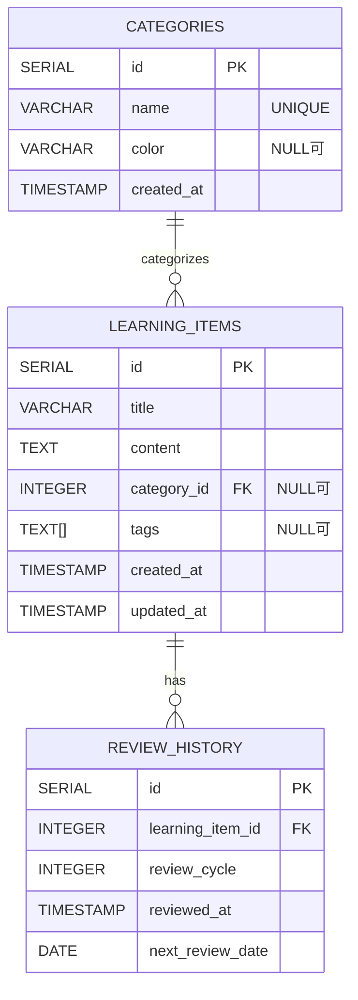

# ER図（基本設計）

参照: design/Requirements/app.md（データベース設計）

## ER図（Mermaid）

## 補足（要件との整合）

- categories と learning_items は、learning_items.category_id（NULL可）で関連付ける。
- これにより、カテゴリ名称は categories.name を正として扱える（カテゴリ名の揺れを防ぐ）。
