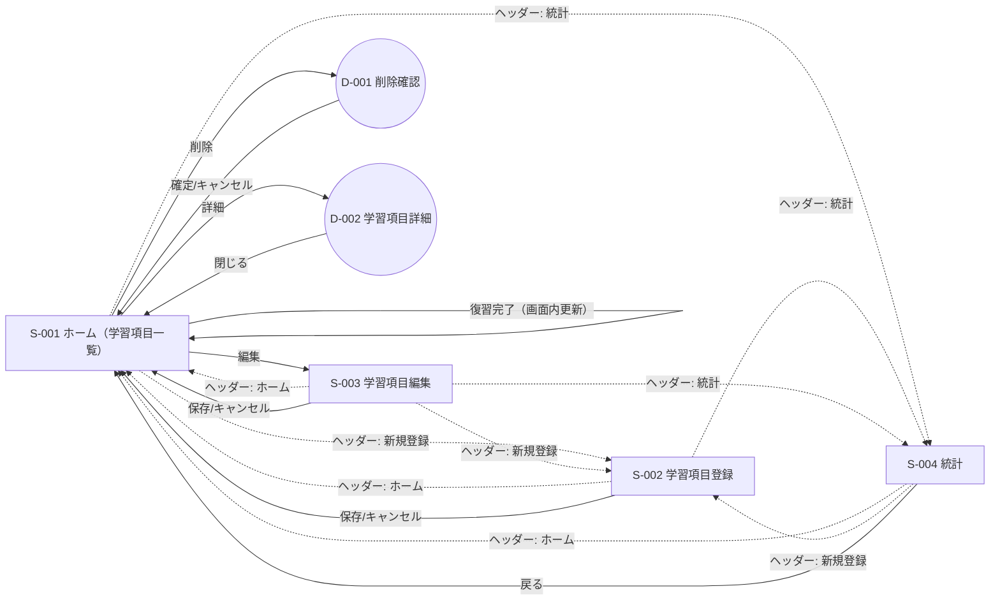

# 画面遷移一覧（基本設計）

参照: design/Requirements/app.md

## 1. 画面一覧

| 画面ID | 画面名 | URL（案） | 説明 |
| --- | --- | --- | --- |
| S-001 | ホーム（学習項目一覧） | `/` | 学習項目一覧、検索・フィルタ、復習状態表示、復習完了、編集/削除、新規登録への導線 |
| S-002 | 学習項目登録 | `/learning-items/new` | 学習項目の新規登録フォーム |
| S-003 | 学習項目編集 | `/learning-items/:id/edit` | 学習項目の編集フォーム |
| S-004 | 統計 | `/statistics` | 学習統計とグラフの表示 |

### ヘッダーメニュー（全画面共通）

ヘッダーメニューには以下の3つのリンクがあり、どの画面からでも遷移できることとする。

- ホーム（S-001）
- 新規登録（S-002）
- 統計（S-004）

### ダイアログ/モーダル（画面内コンポーネント）

| ID | 名称 | 起点 | 説明 |
| --- | --- | --- | --- |
| D-001 | 削除確認ダイアログ | S-001 | 削除前の確認。確定で削除APIを呼び、一覧を更新 |
| D-002 | 学習項目詳細モーダル | S-001 | 学習項目の詳細（タイトル/内容/カテゴリ/タグ/復習情報）を表示。閉じると一覧に戻る |

## 2. 遷移一覧（ユーザー操作）

| No | From | To | トリガー | 備考 |
| --- | --- | --- | --- | --- |
| T-001 | * | S-001 | ヘッダーメニュー「ホーム」 | ホームへ遷移 |
| T-002 | * | S-002 | ヘッダーメニュー「新規登録」 | 登録画面へ遷移 |
| T-003 | * | S-004 | ヘッダーメニュー「統計」 | 統計画面へ遷移 |
| T-004 | S-001 | S-003 | 「編集」ボタン | 対象IDをURLに含めて遷移 |
| T-005 | S-001 | D-001 | 「削除」ボタン | ダイアログ表示（画面遷移ではない） |
| T-006 | D-001 | S-001 | 「削除確定」 | 削除API実行後、一覧を再取得して表示更新 |
| T-007 | D-001 | S-001 | 「キャンセル」 | 何もせず閉じる |
| T-008 | S-001 | S-001 | 「復習完了」ボタン | 復習完了API実行後、一覧を更新（並び・状態が変化し得る） |
| T-009 | S-001 | D-002 | 学習項目の行クリック/「詳細」 | モーダル表示（画面遷移ではない） |
| T-010 | D-002 | S-001 | 「閉じる」 | 何もせず閉じる |
| T-011 | S-002 | S-001 | 「保存」 | 登録API成功後、ホームへ戻り一覧を更新 |
| T-012 | S-002 | S-001 | 「キャンセル」 | 未保存でホームへ戻る |
| T-013 | S-003 | S-001 | 「保存」 | 更新API成功後、ホームへ戻り一覧を更新 |
| T-014 | S-003 | S-001 | 「キャンセル」 | 未保存でホームへ戻る |
| T-015 | S-004 | S-001 | 「戻る」/ナビゲーション | ホームへ戻る |

補足: Fromが`*`の行は「全画面共通導線」を表す。

## 3. 画面遷移図（Mermaid）

## 4. 未決事項（確認）

- なし
