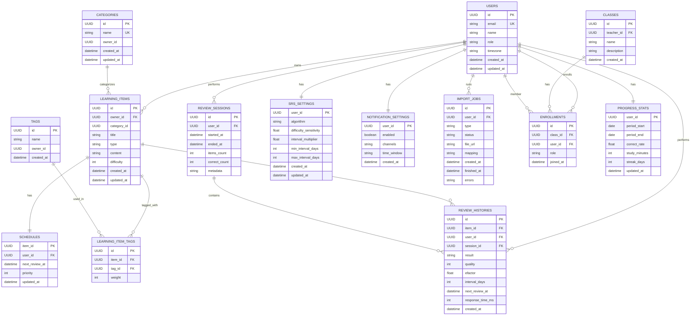

# ER図（基本設計）

参照: design/Requirements/app.md（データベース設計）

参照: design/Entity/エンティティ仕様_忘却曲線.md

## ER図（Mermaid）

## 補足

- `LEARNING_ITEM_TAGS` は多対多の中間テーブルです（`weight` は任意）。
- `SCHEDULES` は `REVIEW_HISTORIES.next_review_at` の最新値をキャッシュする用途です。
- `REVIEW_HISTORIES` は追加（append-only）で監査や統計に利用します。
- 推奨インデックス: `SCHEDULES(next_review_at)`, `REVIEW_HISTORIES(next_review_at)`, `LEARNING_ITEM_TAGS(item_id, tag_id)`
